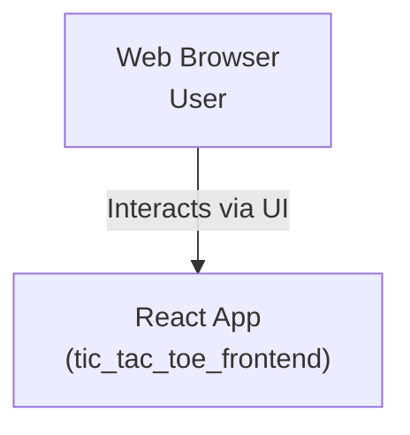

# Architecture Document: Tic Tac Toe Web App

## System Context

The Tic Tac Toe project is a lightweight, web-based 3x3 grid game supporting two local players, developed with React. It is designed for modern browsers and is intended to be run as a single-page frontend application, served over HTTP on port 3000, with no backend dependencies in its current form.

- **Primary Users**: Individuals seeking to play a simple, interactive game in the browser.
- **Environment**: Runs entirely in-browser (desktop/mobile), delivered via a React development server or static deployment.
- **External Dependencies**: None (future: potential backend for AI/multiplayer).

## Container Diagram & Description

The application consists of a **single container**:

- **tic_tac_toe_frontend**
    - Platform: Web (React 18+)
    - Delivered via: HTTP (out-of-the-box React dev server or static host)
    - Entry: `tic_tac_toe_frontend/src/index.js` → `App.js`
    - No API or backend services are called in current implementation.



## Component Architecture

The main UI and logic are structured into several React components (located in `src/`):

- **App**: Root wrapper, theme control, parent for all UI.
- **Game Board**: Renders a 3x3 grid; handles click events to place X/O.
- **Cell (Square)**: Individual cell, displays its current value; clickable if empty and game not over.
- **Game State Manager (Hooks/State)**: Holds board array, current turn, winner, and provides setters/action handlers.
- **Status Display & Controls**: Shows messages (e.g., "X's turn", "Draw", "X wins!", etc.), and exposes a "Restart" button to reset state.

<sub>*Component files are typically structured as modular JS/JSX files under `src/` (expand as codebase grows).</sub>

## State Management Approach

- **Client-side State with React Hooks**: All gameplay, UI state (theme, board, winner, etc.) are managed within local component state using the `useState` and `useEffect` hooks—no Redux or global store required for this simple scope.
- **Board Representation**: One-dimensional array (`Array(9)`) storing `'X'`, `'O'`, or `null`.

## Principal Interaction Flows

1. **Place Mark**:
   - User clicks an empty cell.
   - If the game is not finished, the corresponding cell of the board state array is updated with the current player's symbol (`X` or `O`).
   - The turn switches to the next player.

2. **Evaluate Win or Draw**:
   - After each move, the board is checked for a winning combination (three in a row/column/diagonal).
   - If found, winner state is set and a victory message displayed.
   - If the board fills with no winner, a draw is declared.

3. **Restart Game**:
   - User clicks "Restart".
   - Board array resets to all `null`, current turn set to initial player, winner state cleared.

## Data Model

```
{
  board: ['X', null, 'O', ...], // 9 elements, each either 'X', 'O', or null
  currentPlayer: 'X' | 'O',
  winner: null | 'X' | 'O' | 'Draw',
  movesCount: integer (0-9)
}
```
- **Persistence**: No backend storage or local persistence; each play session is ephemeral per browser tab.
- **No backend APIs used**.

## Deployment & Runtime

- **Development**: Run via `npm start`, launches React's dev server on [http://localhost:3000](http://localhost:3000)
- **Production**: Build static assets with `npm run build`; deploy to any static host (e.g., Netlify, Vercel, GitHub Pages)
- **Port**: 3000
- **Entrypoint**: `src/index.js` mounts `<App />` to the page.

## Configuration

The environment supports the following `.env` variables (though not all are actively used in the current frontend-only build):

- `REACT_APP_API_BASE`
- `REACT_APP_BACKEND_URL`
- `REACT_APP_FRONTEND_URL`
- `REACT_APP_WS_URL`
- `REACT_APP_NODE_ENV`
- `REACT_APP_NEXT_TELEMETRY_DISABLED`
- `REACT_APP_ENABLE_SOURCE_MAPS`
- `REACT_APP_PORT`
- `REACT_APP_TRUST_PROXY`
- `REACT_APP_LOG_LEVEL`
- `REACT_APP_HEALTHCHECK_PATH`
- `REACT_APP_FEATURE_FLAGS`
- `REACT_APP_EXPERIMENTS_ENABLED`

*Note: These are available for potential future backend/API integration, but not required in the current no-backend app.*

## Non-Functional Requirements

- **Performance**: Minimal JS bundle size; instant UI response with no network latency except for initial load.
- **Accessibility**: Uses semantic HTML elements where possible; keyboard navigation and screen reader support should be ensured.
- **Responsiveness**: Layout adapts for desktop and mobile (flex/grid CSS used).
- **Cross-browser**: Supports all modern browsers.
- **Styling**: Light theme is default, with accent colors:
    - Primary: `#3b82f6`
    - Secondary: `#06b6d4` (success)
    - Clean, modern layout; game board centered, controls above/below.

## Styling and Layout

- **Theme**: Light theme, with option for user theme toggle (future: can support dark mode).
- **Accents**: The main colors are blue accent (#3b82f6) and cyan (#06b6d4).
- **Layout**: Game grid is centered both vertically and horizontally. Controls/status appear above and below the grid. Scales for mobile.
- **See**: `src/App.css` for color variable definitions and responsive layout classes.

## Future Extensions

- **Backend AI Opponent**: Add a backend (or client-side logic) to play vs. a computer opponent.
- **Multiplayer with WebSockets**: Leverage `REACT_APP_WS_URL` and add a backend to enable real-time remote play.
- **Game History**: Store and show past matches (may require backend or browser storage).
- **User Profiles**: Login/logout, track stats.
- **Progressive Web App**: Add service workers/offline support.

## Assumptions and Constraints

- Assumes only two players per session, both on the same device/browser session.
- No authentication, user persistence, or network communication in MVP.
- Logic, UI, and state all reside on the frontend with no backend involvement.
- Application is self-contained; introducing backends or persistent state will require architectural changes.
- The styling aligns with provided guidelines: modern, accessible, accent colors, and centered layout.

---

**References**
- `tic_tac_toe_frontend/src/` (components, hooks, assets)
- `tic_tac_toe_frontend/src/App.css` (styling/theme)
- `README.md` (usage/build instructions)
